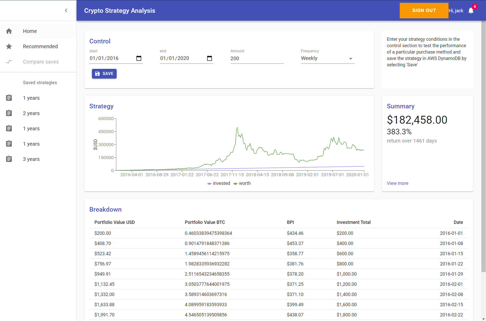

# In Review

This project was very exciting to learn how some emerging technologies work and how to implement them together, particularly learning about GraphQL APIs, AWS and Stateful frontend UI frameworks like React.
Lifting state, hooks, props, JavaScript higher-order functions, JSX, Testing

The application went through many... iterations of re-refactoring the whole codebase (that's what's great about learning technologies first hand!) as I understood more effective ways to implement different features.

# Intro

This is started as an API project, to use the https://www.coindesk.com/coindesk-api API and generate useful insight for crypto coins. 

I wanted to understand how effective different static bitcoin
investment strategies would have been against historic bitcoin prices,
static being what if I was to purchase \$100 of coin on the first of
every month, how effective would this strategy be? As opposed to
manually trying to time the market to optimise portfolio value. 

I understand this task could have been done far more quickly using
excel compared to learning to use React and revisiting JS, however I
wanted to learn a new UI framework. 

A goal for this project is to revisit and look at how code can be refactored to produce efficient and easy to understand code, throughout the development of the project. Even the most complex of functions can be refactored into simple logic statements (most of the time). 

## AWS AppSync API and Amplify Authentication

Setup the GraphQL API and Amplify Authentication resources using AWS Amplify.
See https://docs.amplify.aws/cli/start/install to configure Amplify CLI and connect your AWS account.

Then add the API GraphQL and Auth using AWS Cognito User Pool services to handle the data and user stores, and finally push the changes to provision all cloud resources.

### amplify add auth

### amplify add API

### amplify push

## Commands

Run the app in development mode. 

### `npm start`

Run the test runner to check UI Components. 

### `npm test`

Build the app for production to the `build` folder.
It correctly bundles React in production mode and optimizes the build for the best performance.
The build is minified and the filenames include the hashes. 

### `npm run build`
